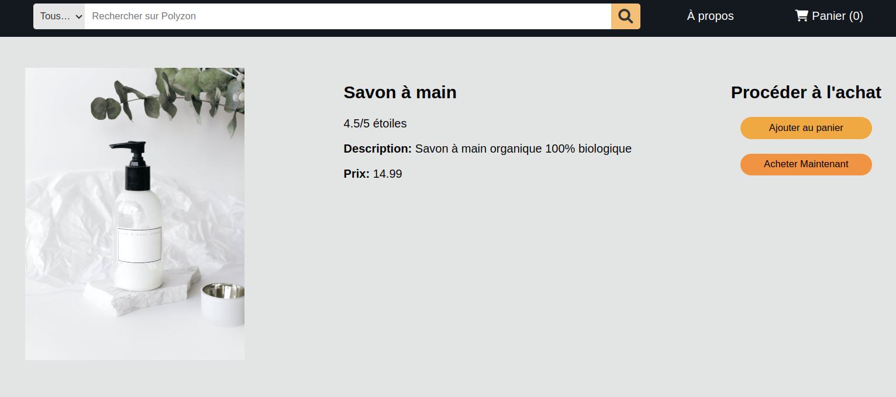
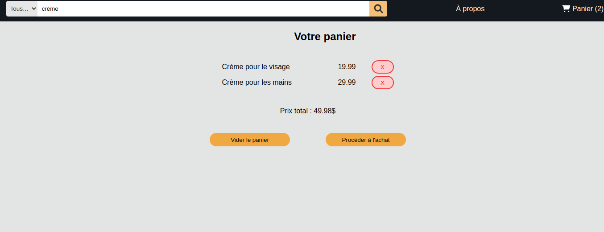
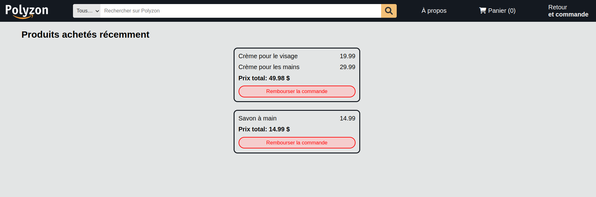
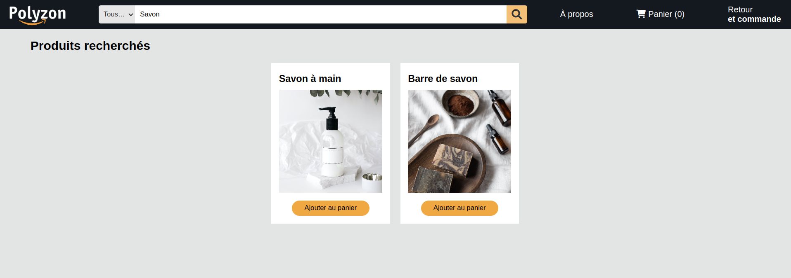

# TP4 PolyZon


# Mise en context et objectifs du travail pratique

Le but de ce travail pratique est de vous familiariser avec le développement d'une application web _full stack_ utilisant une base de données pour assurer la persistance des données. Pour ce faire, vous utiliserez la librairie _React_ pour le côté client et vous vous connecterez à une base de données _MongoDB_ à partir d'un environnement _NodeJS_ pour le côté serveur.

L'application à compléter est une preuve de concept d'un magasin en ligne qui permet à l'utilisateur de consulter des produits, de les ajouter à un panier et de passer une commande. Par la suite, l'utilisateur peut consulter ses commandes passées et faire une demande de remboursement. L'application est déjà partiellement développée et vous devez compléter les fonctionnalités manquantes.

Le code source fourni contient deux applications distinctes, soit une application ReactJS (répertoire `site-web`) ainsi qu'une application NodeJS/Express (répertoire `server`). L'application React est constituée de composantes qui se retrouvent dans les répertoires `components` et `pages`.
Le serveur, pour sa part, comprend des contrôleurs, des services et des données par défaut que vous pourrez retrouver dans `server/controllers`, `server/services` et `server/data`. C'est le fichier `server.js` qui sera exécuté au lancement du serveur.

## Configuration de la base de données

Vous devez configurer une instance MongoDB pour la persistance de vos données. Vous devez utiliser le service [Cloud Atlas](https://www.mongodb.com/cloud/atlas).

Vous devez configurer votre instance avant de pouvoir effectuer le travail demandé. Un guide pour la configuration d'instances MongoDB avec Cloud Atlas est disponible sur le projet [GitHub du cours](https://github.com/LOG2440/Cours-11-MongoDB/blob/master/README.MD) de l'exemple sur MongoDB présenté en classe.

Le fichier `env.js` contient les constantes avec les informations de connexion à votre instance MongoDB. Vous devez les remplacer avec les bonnes valeurs de votre propre instance. 

**Important** : Assurez-vous de remettre le fichier `env.js` avec les bonnes valeurs avant de remettre votre travail.

## Installation des librairies nécessaires

Pour installer les dépendances nécessaires, lancez la commande `npm ci` dans la racine de chaque application (et donc deux fois au total). Ceci installera toutes les librairies définies dans le fichier `package-lock.json`. Vous pouvez par la suite utiliser les libraires de test (pour le serveur) et les scripts définis dans le même fichier.

## Déploiement local

Lors du développement, vous pouvez faire un déploiement local d'un serveur statique qui servira votre site web et de votre serveur dynamique avec la commande `npm start`. Notez bien qu'il faut exécuter la commande à la racine de chaque application (dans `/site-web` et `/server`) dans deux consoles distinctes afin que les deux fonctionnent en parallèle.

Le serveur statique sera déployé à l'adresse `localhost:5010` (ou `<votre-adresse IP>:5010`). Le serveur dynamique sera déployé à l'adresse `localhost:5020` et commencera à écouter le port 5020.

Notez que l'origine du site web n'est pas le serveur dynamique. Vous devez donc configurer votre serveur dynamique en conséquence pour accepter les requêtes provenant de l'origine du serveur statique.

# Description du travail à compléter

Il est conseillé de lire l'ensemble du travail demandé et d'implémenter les fonctionnalités une à la fois sur le serveur ET le site web. Vous pouvez également commencer par implémenter le code côté serveur en premier avant de vous attaquer au site web.

## Format des données et les données initiales

Consultez le fichier `products.json` dans le répertoire `data` pour des exemples de la structure de l'objet d'un produit à manipuler. 

Les commandes sont représentées comme des objets JSON avec les attributs suivants qui font référence aux produits achetés, le coût total de la commande et un identifiant unique. Voici un exemple :
```json
{
    "productIds": [ "1", "2", "3" ],
    "totalCost": 123.45,
    "id": "acb86e8a"
  }
```
La génération d'un id unique pour les commandes est déjà implémentée pour vous dans le fichier `purchase.service.js`.

Le résultat des manipulations de votre système doit produire des objets ayant la même structure. La persistance et toute donnée supplémentaire sera gérée par votre base de données MongoDB. 

# Serveur dynamique

Vous devez établir la communication avec une base de données MongoDB à partir de votre serveur dynamique. Pour ce TP, on vous demande de placer les différentes données dans 2 collections séparées nommées `PURCHASES` et `PRODUCTS`.

Lors du lancement du serveur dans `server.js`, celui-ci se connecte à la base de données et ajoute les données initiales dans la collection des produits, seulement si cette collection est vide. Initialement, il n'y a aucune commande dans le système. Ceci vous permettra d'avoir des données initiales avec lesquelles tester votre système.

Vous devez implémenter les fonctionnalités présentes dans les classes `ProductService`, `PurchaseService` et `DatabaseService` qui représentent les services principaux dans votre système. La classe `SearchBarService` est implémentée pour vous, mais fera appel à la fonction que vous aurez à implémenter. 

Vous n’avez pas besoin de modifier les contrôleurs des routeurs Express fournis, mais vous devez compléter la configuration du serveur (TODO dans `server.js`). Chaque fonction à implémenter contient le mot clé TODO dans son en-tête. Les fonctions à compléter retournent des valeurs par défaut afin de permettre l’exécution du code, mais vous devez modifier ces valeurs de retour.

### DatabaseService

Vous devez implémenter la fonction `populateDb` qui remplit une collection avec des données seulement si la collection est vide. Cette fonction est exécutée lors du lancement du serveur et remplit la BD avec les valeurs du fichier JSON du répertoire `data` du projet. Si la collection de la BD contienne déjà des valeurs, aucune modification ne devra avoir lieu. 

### ProductService

Ce service s'occupe des produits et leurs manipulations sur la base de données. Consultez les en-têtes des fonctions à implémenter ainsi que les tests présents dans `product.service.test.js` pour bien comprendre le fonctionnement des méthodes.

Notez qu'il n'y a pas de méthodes d'ajout de nouveaux produits dans la base de données. Les produits sont ajoutés à la base de données lors du lancement du serveur à partir du fichier `products.json`. Vous pouvez ajouter vos propres produits dans ce fichier pour les ajouter à la base de données si vous le désirez.

### PurchaseService

Ce service s'occupe des commandes et leurs manipulations sur la base de données. Consultez les en-têtes des fonctions ainsi que les tests présents dans `purchase.service.test.js` pour bien comprendre le fonctionnement des méthodes. Contrairement aux produits, il est possible d'ajouter et supprimer des commandes (appelé **demande de remboursement** dans le reste de l'énoncé). Notez que la fonction `getPurchaseProducts` permet de récupérer des informations sur les produits achetés dans une commande et doit donc intéragir avec le service `ProductService`.

### SearchBarService

Le code de la fonction `search` vous est déjà fourni. Vous devez compléter la fonction `search` dans `ProductService` qui va effectuer la recherche par mot clé.

La recherche doit tenir compte des champs possibles (nom et description du produit) et tenir compte du paramètre `exact` (recherche sensible à la case). *Astuce* : l'opérateur logique [$or](https://www.mongodb.com/docs/manual/reference/operator/aggregation/or/) de MongoDB vous sera utile.

La recherche se fait sur une sous-chaîne dans les attributs. Par exemple, la recherche `Savon` sans attribut `exact` devrait retourner les produits "Savon à la main" et "Barre de savon". La même recherche avec attribut `exact` devrait retourner seulement "Savon à la main" (sensible à la case).

# Site web

Vous allez utiliser le patron [SAM](https://sam.js.org/) et le concept de `Reducer` pour gérer les actions envoyées par les composantes et modifier l'état de votre panier. Chaque action contient obligatoirement un type et, optionnellement, un contenu (`payload`). Par exemple : `{ type: ACTIONS.ADD_TO_CART, payload: { product } }`. Le fichier `reducer.js` contient le `Reducer` utilisé. Lisez bien le code fourni pour comprendre la bonne formulation des actions à envoyer. Vous aurez à implémenter la logique de gestion de certaines actions.

### Composantes de pages

Le répertoire `pages` contient l'ensemble des composantes React qui définissent les différentes "pages" de votre site web. Le site possède plusieurs pages : `Home` (Page principale), `About` (À propos), `Product` (Page de produit), `Cart` (Panier), `Returns` (Retour et commandes) et `Search` (Résultats de la recherche). Comme vous avez un site monopage (_SPA_), toutes ces pages sont des composantes React dans le même document HTML. Vous devez configurer correctement les routes vers chacune des pages dans le fichier `App.jsx` pour s'assurer que chaque URL est lié à la bonne composante à afficher.

La composante `About` (page à propos) vous est fournie et vous n'avez pas à la modifier. Les autres composantes contiennent le mot clé **TODO** aux endroits à compléter.

#### Page Principale (Home.jsx)

Cette page affiche les produits disponibles dans votre magasin. Voici le visuel avec les donnes initiales fournies : 


Vous devez compléter la récupération des produits au chargement de la composante et leur affichage à l'aide de composantes `ProductCard`. Chaque produit est affiché dans une vignette avec son image, son nom et un bouton d'ajout au panier. Si le produit est déjà dans le panier, le même bouton permet de le retirer.

#### Page d'un produit (Product.jsx)

Cette page affiche les informations d'un produit spécifique. La page offre la possibilité d'ajouter le produit au panier ou de procéder à son achat directement sans avoir à passer par le panier.

Voici son visuel : 



Tout comme la page principale, si le produit est déjà dans le panier, le premier bouton permet de le retirer. Le deuxième bouton permet d'acheter directement le produit sans passer par le panier et génère une commande dans le système.


Vous devez compléter le HTML de la composante pour l'affichage des informations du produit. Vous devez implémenter le fonctionnement des deux boutons dans l'interface pour l'ajout du produit dans le panier ou son achat direct.  Consultez l'implémentation du `reducer` pour bien comprendre les actions à envoyer.

### Page de panier (Cart.jsx)

Cette page permet d'afficher le panier et son contenu : chaque nom de produit accompagné de son prix. Un bouton permet de retirer chaque produit du panier. Vous devez implémenter cette action dans le `reducer`.

Le prix total est toujours affiché à la fin de la liste et doit être mis à jour à chaque modification du panier. Voici le visuel de la page suite à 2 ajouts de produits différents :



Le bouton "Vider le panier" permet de retirer tous les produits du panier. Un message "Le panier est présentement vide" est alors affiché. Vous devez implémenter cette action dans le `reducer`.

Le bouton "Procéder à l'achat" permet de générer une commande dans le système. Le panier est vidé suite à cette action et l'interface est mise à jour.

Les 2 boutons sont disponibles seulement si le panier n'est pas vide.

Vous devez compléter le HTML de la composante pour l'affichage des informations du panier et la gestion de la suppression des produits.

### Page de retour et commandes (Returns.jsx)

Cette page permet d'afficher les commandes passées par l'utilisateur et de faire une demande de remboursement. Chaque commande est affichée à l'aide de la composante `Purchase`. Si aucune commande n'est présente, le message "Aucun produit n'a été acheté" est affiché à l'utilisateur. Voici le visuel de la page suite à 2 commandes différentes :



Vous devez compléter le HTML de la composante pour l'affichage des informations des commandes et la gestion de la demande de remboursement. La fonction `updatePurchases` permet la mise à jour de la liste de commandes suites à une demande de remboursement.

### Page de recherche (Search.jsx)

Cette page est visuellement similaire à la page principale, mais contient seulement le résultat d'une recherche à travers la barre de recherche dans l'entête du site. Vous êtes redirigé vers cette page lors d'une recherche, peu importe la vue d'origine. Voici le visuel de la page :



Vous devez compléter la récupération des produits au chargement de la composante et leur affichage à l'aide de composantes `ProductCard`. 

### Autres composantes

Le répertoire `components` contient l'ensemble des autres composantes React qui définissent les différents éléments utilisés dans les composantes de pages du site web. Les composantes `SearchBox` et `Footer` vous sont fournies pour vous aider avec votre travail et vous n'avez pas à les modifier sauf pour ajouter vos noms dans `Footer`.

Les autres composantes contiennent des éléments à compléter. Le mot clé **TODO** est présent aux endroits à compléter. Vous devez compléter des fonctions ou compléter le HTML retourné par la composante en utilisant la bonne syntaxe JSX.

#### Barre de navigation (NavBar.jsx)

Cette composante est partagée par toutes les pages.

Vous devez ajouter les bons liens vers les pages `/about`,`/cart` et `/returns` en utilisant les bons éléments de la librairie `react-router-dom` et non la balise `<a>`. Référez-vous aux captures d'écran plus haut pour le visuel attendu.

Notez que le lien vers le panier indique le nombre de produits dans celui-ci. Vous devez compléter le code qui permet une mise à jour automatique de ce nombre à chaque modification (ajout ou retrait) du panier.

#### Carte de produit (ProductCard.jsx)

Cette composante est utilisée dans `Home.jsx` et `Search.jsx` pour afficher les produits disponibles dans le magasin. Vous devez compléter le code HTML pour l'affichage des informations du produit. Referrez-vous à la première capture d'écran pour le visuel attendu.

Cliquer sur l'image du produit devrait rediriger l'utilisateur vers la page du produit en question. Le bouton d'ajout au panier doit ajouter le produit au panier ou le retirer si le produit est déjà dans le panier. Le code JSX du bouton vous est fourni et vous devez implémenter la logique de gestion de ces 2 actions dans `reducer.js`. 

Notez qu'un produit ne peut pas se retrouver dans le panir plus qu'une fois et que toute modification du panier doit être réflétée dans la barre de navigation.

#### Commande (Purchase.jsx)

Cette composante est utilisée dans `Returns.jsx` pour afficher les commandes passées par l'utilisateur. Chaque commande est composée d'au moins 1 produit et le prix total de la commande. Vous devez compléter le code HTML pour l'affichage des informations de la commande. Referrez-vous à l'avant dernière capture d'écran pour le visuel attendu.

Cette composante contient 1 seul bouton qui permet de faire une demande de remboursement pour la commande en question. Vous devez compléter le code pour envoyer une action de remboursement au `reducer` et une mise à jour de la page parent par la suite. Une demande de remboursement ne doit pas affecter le contenu du panier en cours.

## Exécution des tests

Veuillez consulter le fichier [TESTS.MD](./TESTS.MD) pour plus d'informations sur les tests du travail.

## Fonctionnalité bonus

Dans la version de base de votre projet, le contenu du panier n'est pas persisté. Si l'utilisateur rafraîchit la page ou ferme le navigateur, le contenu du panier est perdu. Vous devez mettre en place une persistance du panier qui permet de conserver le contenu du panier tant et aussi longtemps que la page n'est pas complétement fermée. Vous devez implémenter cette fonctionnalité dans la logique du `reducer` seulement. Vous n'avez pas à modifier le serveur pour cette fonctionnalité.

# Correction et remise

La grille de correction détaillée est disponible dans [CORRECTION.MD](./CORRECTION.MD). Le navigateur `Chrome` sera utilisé pour l'évaluation de votre travail. L'ensemble des tests fournis doivent réussir lors de votre remise. Les tests ajoutés par l'équipe doivent aussi réussir.

Le travail doit être remis au plus tard le mardi 16 avril à 23:55 sur l'entrepôt Git de votre équipe. Le nom de votre entrepôt Git doit avoir le nom suivant : `tp4-matricule1-matricule2` avec les matricules des 2 membres de l’équipe.

**Aucun retard ne sera accepté** pour la remise. En cas de retard, la note sera de 0.
